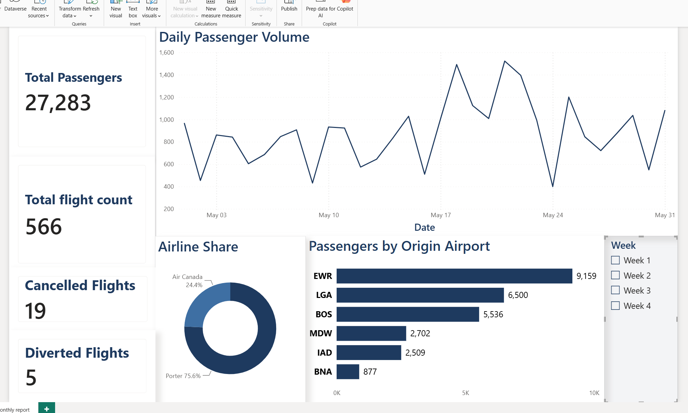
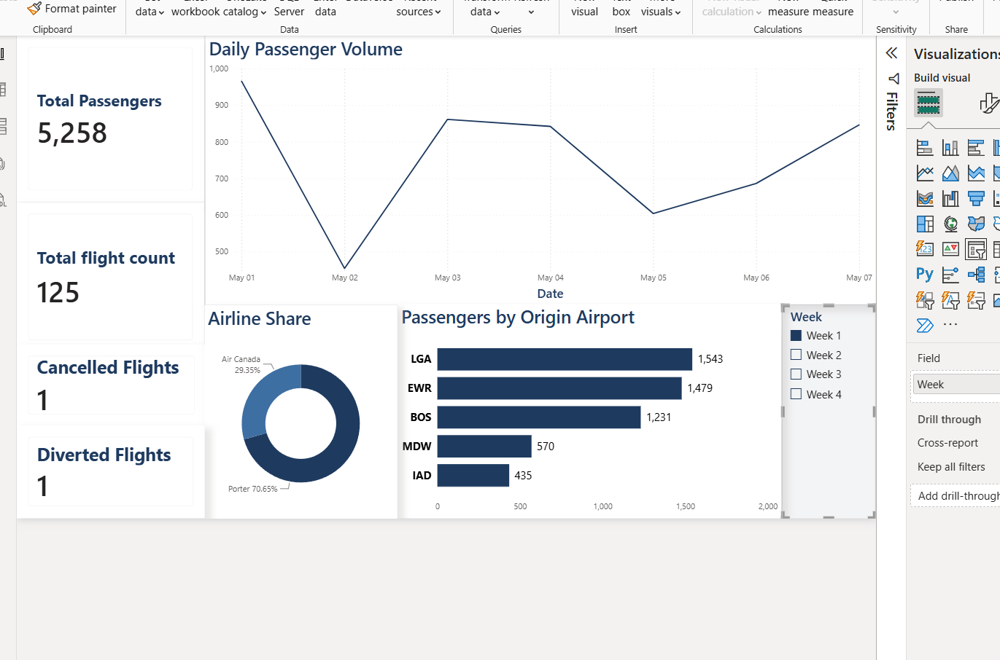
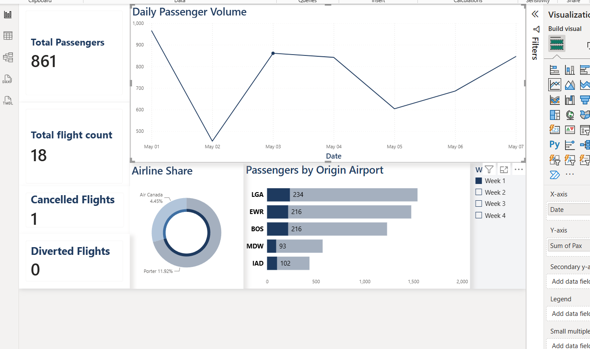
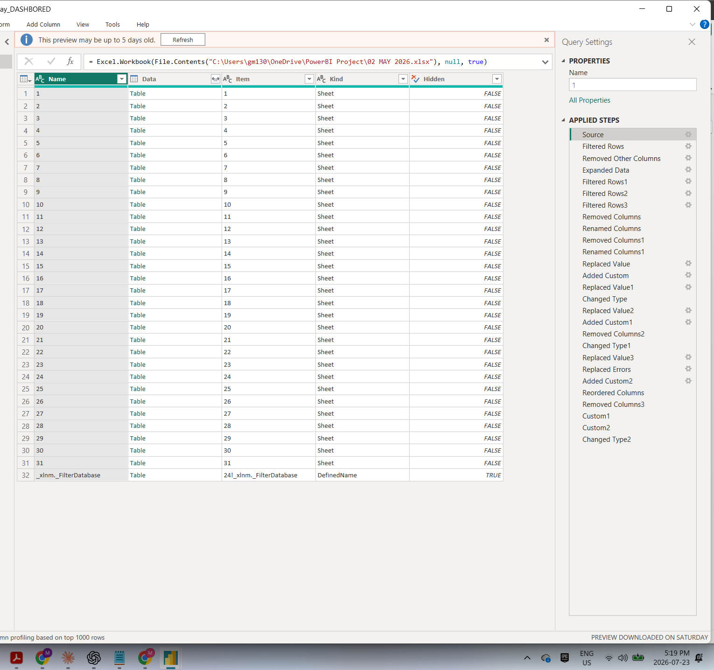

# Flight Ops ETL Pipeline & Power BI Dashboard

This is a project where I took a month's worth of messy, real-world-style airline shift reports and turned them into a clean dataset and a working Power BI dashboard. I built the whole thing with Power Query (M), DAX, and Power BI Desktop.

The raw data came as one Excel file with **31 separate sheets**, one for every day in May, filled out by hand by shift staff. It was a mess: headers weren't consistent from sheet to sheet, there were random subtotal rows mixed in with the actual data, some columns had different data types in the same column, flight numbers had typos, and a few values were negative because of data-entry mistakes. My job was to build a cleanup process that could handle all of that automatically and turn it into **566 clean flight records**, plus a dashboard on top. I set it up so that if you drop in a new month's file, it flows through the same process with no manual fixing required.

> Only non-sensitive info is in here: flight numbers, timestamps, gate, passenger counts, and origin airport. Nothing confidential or carrier-proprietary is published in this repo.

---

## What the Dashboard Looks Like

**The full month at a glance: 27,283 passengers across 566 flights, May 1 to 31**


**Filtered down to just one week using the slicer**


**Behind the scenes: how the charts are configured**


**The Power Query Editor, showing the cleanup steps I built**


---

## The Data

| | |
|---|---|
| Source | One Excel workbook, 31 sheets (one per day of May) |
| What each sheet looked like | A handwritten "Daily Shift Report": messy headers, stray totals rows, mixed data types, typos |
| What I ended up with | 566 clean flight records covering May 1 to 31 |
| Breakdown | 542 arrived, 19 cancelled, 5 diverted |
| Airports involved | EWR, LGA, BOS, MDW, IAD, BNA (6 origins) |
| Carriers | Porter (75.6% of passengers) and Air Canada (24.4%) |

---

## How I Cleaned It Up (Power Query / M)

I built out about 30 steps in Power Query to take those 31 messy sheets and turn them into one clean table. Here's what that involved:

- **Stripping out the junk**: every sheet had header rows, blank filler rows, and totals rows mixed in with the real data. I filtered all of that out across all 31 sheets at once instead of doing it sheet by sheet.
- **Stacking all 31 days into one table**: I used a step that automatically expands and combines all the daily sheets into a single table. This means if someone hands me next month's file, it runs through the exact same process without me touching anything.
- **Fixing data types**: a bunch of columns had come in as plain text when they should have been numbers or times, so I corrected those.
- **A few custom fixes I had to write myself**:
  - Some values were negative because of typos, which isn't physically possible for the fields they were in, so I wrote a step that finds and nulls those out.
  - I found 18 flight numbers that were consistently entered wrong across the sheets, so instead of fixing them one by one by hand, I wrote a single step that swaps all 18 wrong-to-correct pairs in one pass, basically a mini lookup table done in code.
  - The status of each flight (arrived, cancelled, or diverted) wasn't marked in one consistent place. It was scattered across different columns depending on the sheet, so I wrote logic that scans multiple columns for keywords and builds a proper Status column from that.
  - There was a "processing time" column in the source data that I didn't trust: it mixed units and even had a negative number in it. So instead of using it, I recalculated it myself directly from the timestamps.
- **What came out the other end**: 17 clean, correctly-typed columns ready to build a dashboard from: Day, Flight, Origin, ETA, ATA, Crew, Pax, FirstPax, LastPax, ProcessMinutes, Gate, BSO, RefCust, RefImm, RefCFIA, RefExams, Status, and Date.

---

## Figuring Out Which Airline (DAX)

The source data didn't have an "airline" field, but flight numbers follow a pattern, so I wrote a DAX formula that classifies each flight by carrier based on its flight number:

```dax
Airline =
IF(
    LEFT(FORMAT('1'[Flight], "0"), 2) = "85" || FORMAT('1'[Flight], "0") = "9804",
    "Air Canada",
    "Porter"
)
```

---

## What's on the Dashboard

- **3 KPI cards up top**: Total Passengers (27,283), Total Flights (566), and Cancelled Flights (19)
- **A line chart** showing daily passenger volume across the month
- **A bar chart** breaking down passengers by origin airport (6 airports)
- **A donut chart** showing the passenger split between carriers
- **A week slicer** so you can click between Week 1 through 4 or view the whole month, and everything on the page updates together
- **General styling**: custom color theme, card effects, a header banner, cleaned-up titles and labels

---

## Tools I Used

Power BI Desktop, Power Query (M), DAX, and Excel. I used OneDrive to keep the working files in sync while building this across two different computers.

---

## What's in This Repo

```
flight-ops-etl-pipeline/
├── README.md
└── screenshots/
    ├── 01-dashboard-full-month.png
    ├── 02-dashboard-week1-filter.png
    ├── 03-visual-builder-slicer.png
    └── 04-power-query-applied-steps.png
```

I kept the actual `.pbix` file and the source Excel workbook on my own machine rather than uploading them here, since they contain the full dataset. This repo is meant to show how I approached the problem and what the finished dashboard looks like.
